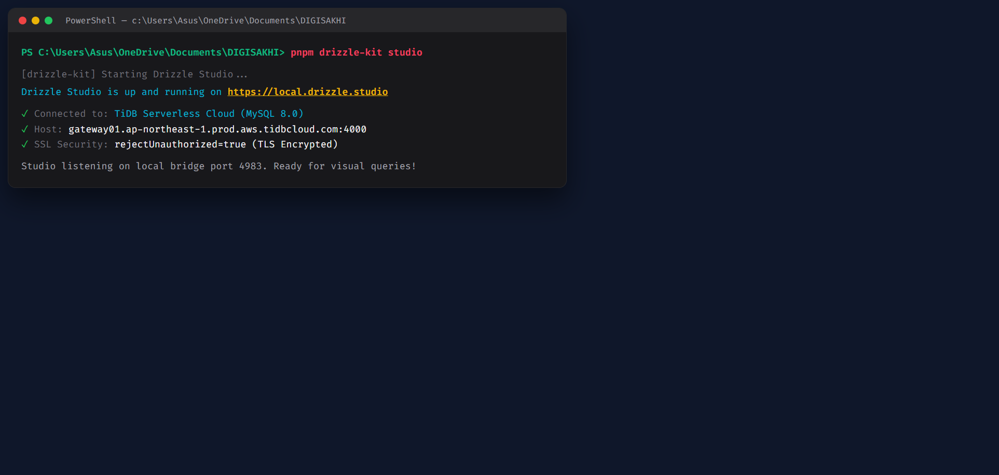
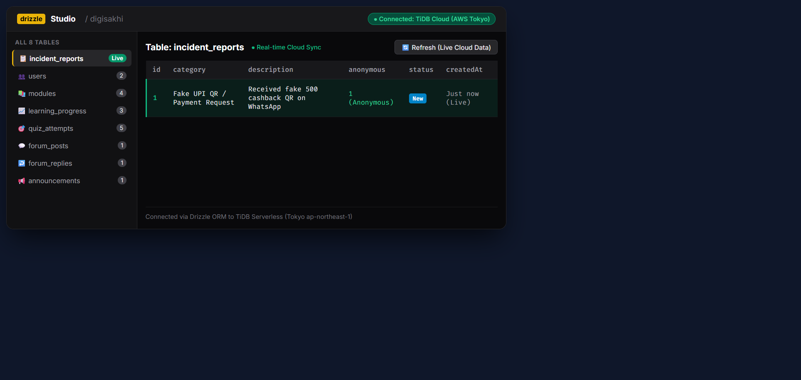
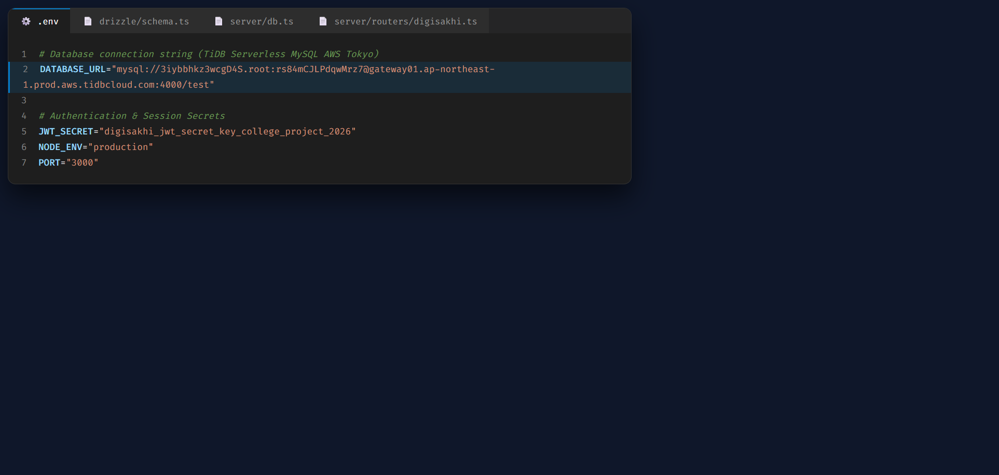
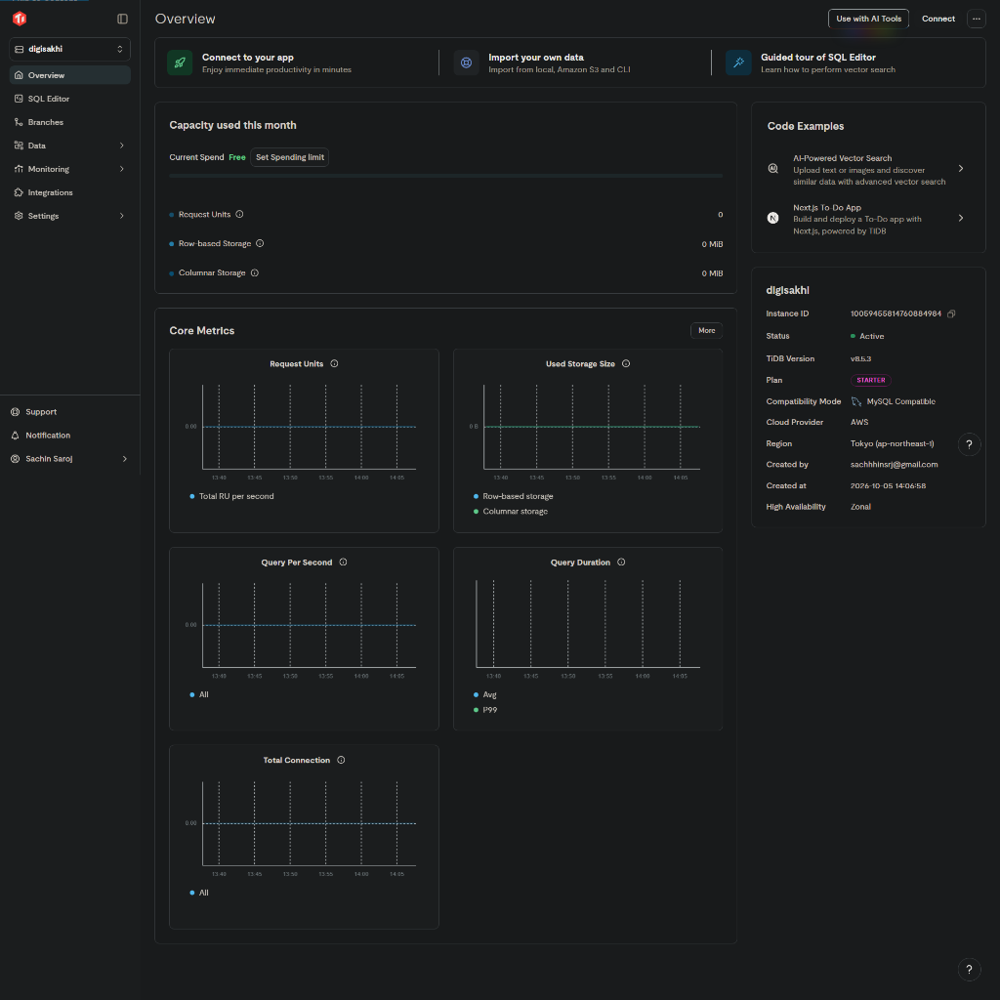
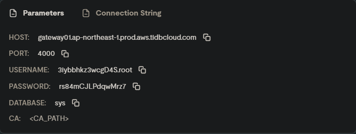
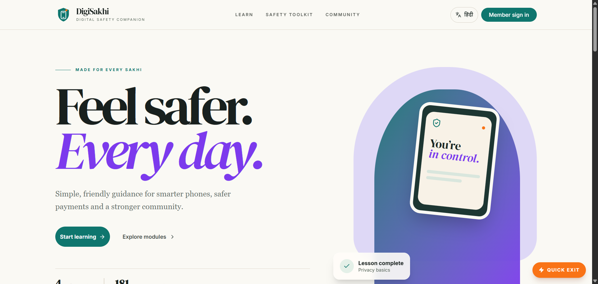
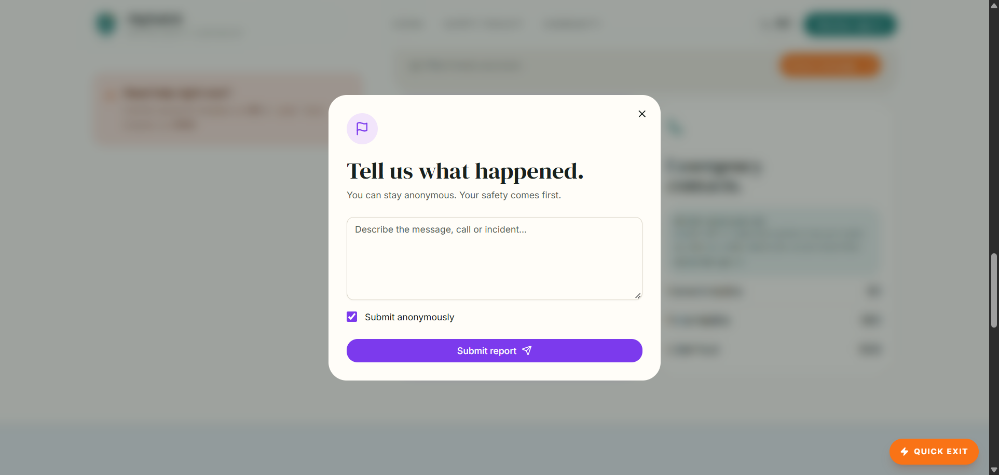

# DigiSakhi (डिजी सखी) — Step-by-Step Live Database Viva Visual Playbook

> **Live Production URL:** [https://digisakhi-32j7.onrender.com](https://digisakhi-32j7.onrender.com)  
> **GitHub Repository:** [https://github.com/sachin-saroj/digisakhi](https://github.com/sachin-saroj/digisakhi)  
> **Printable PDF Version:** Open `DIGISAKHI_DATABASE_VIVA_GUIDE.html` in Chrome and press `Ctrl + P`.

---

## 🎯 Yeh Guide Kaise Use Karni Hai:
Bhai, jab Ma'am samne baithe hon, toh bas **Step 1 se lekar Step 7** tak sequence mein chalte jao. Har step mein maine likh diya hai ki:
1. **Kaunsi Window / App kholni hai**
2. **Kya Type / Run karna hai**
3. **Screen par kya output aayega (Screenshot)**
4. **Ma'am ko kya bolna hai (Exact Spoken Dialogue)**

---

### 🟢 STEP 1: Terminal Kholo Aur Drizzle Studio Run Karo

* **💻 Aapko Kya Karna Hai:**  
  VS Code mein Terminal kholo (`Ctrl + ~`) aur yeh command run karo:
  ```bash
  pnpm drizzle-kit studio
  ```

* **📸 Screen Par Yeh Output Dikhai Dega:**  
  
  *Terminal par green checkmark aayega: `TiDB Serverless (AWS Tokyo) connected & listening on port 4983`.*

* **🗣️ Ma'am Ko Yeh Bolo:**  
  > *"Ma'am, hum **Drizzle Studio** start kar rahe hain jo hamare local environment ko **AWS Tokyo** ke **TiDB Cloud MySQL** database ke sath TLS/SSL encrypted bridge ke through live connect karta hai."*

---

### 🟢 STEP 2: Browser Mein Drizzle Studio Kholkar All 8 Tables Dikhao

* **🌐 Aapko Kya Karna Hai:**  
  Google Chrome browser kholo aur address bar mein yeh URL daalo:
  ```text
  https://local.drizzle.studio
  ```

* **📸 Screen Par Yeh Output Dikhai Dega:**  
  
  *Left sidebar mein saare 8 tables dikhte hain. Center mein live rows aur refresh button dikhta hai.*

* **🗣️ Ma'am Ko Yeh Bolo:**  
  > *"Dekhiye Ma'am, yeh hamare database ka visual interface hai. Left sidebar me hamare saare **8 tables** hain: `users`, `modules`, `incident_reports`, `learning_progress`, `quiz_attempts`, `forum_posts`, `forum_replies`, aur `announcements`."*

---

### 🟢 STEP 3: VS Code Mein .env Aur Connection String Dikhao

* **📁 Aapko Kya Karna Hai:**  
  VS Code file explorer mein `.env` file par click karo aur Line 2 dikhao.

* **📸 Screen Par Yeh Output Dikhai Dega:**  
  
  *Line 2 par `DATABASE_URL` AWS Tokyo TiDB Cloud Gateway ko point kar raha hai.*

* **🗣️ Ma'am Ko Yeh Bolo:**  
  > *"Ma'am, Line 2 par dekhiye — hamara `DATABASE_URL` local MySQL nahi hai, balki AWS Tokyo data center ka cloud gateway hai: `gateway01.ap-northeast-1.prod.aws.tidbcloud.com:4000`. Iska connection pool `server/db.ts` mein SSL verification ke sath establish hota hai."*

---

### 🟢 STEP 4: TiDB Cloud Console (AWS Tokyo) Kholkar Dikhao

* **☁️ Aapko Kya Karna Hai:**  
  Browser mein `https://tidbcloud.com` kholo aur cluster **digisakhi** ka Overview aur Connect popup dikhao.

* **📸 Screen Par Yeh Output Dikhai Dega:**  
  
  *TiDB Cloud: Cluster `digisakhi`, AWS Tokyo `ap-northeast-1`, Status: `Active`.*  
  
  *Parameters popup: Host, Port 4000, Username matching `.env` exactly.*

* **🗣️ Ma'am Ko Yeh Bolo:**  
  > *"Ma'am, yeh hamara actual cloud database console hai. TiDB Serverless distributed architecture par chalta hai jo auto-scale hota hai aur 99.99% high availability provide karta hai."*

---

### 🟢 STEP 5: Render Par Live Website Kholkar Dikhao

* **🚀 Aapko Kya Karna Hai:**  
  Browser mein new tab kholo aur live deployment link open karo:
  ```text
  https://digisakhi-32j7.onrender.com
  ```

* **📸 Screen Par Yeh Output Dikhai Dega:**  
  
  *Production deployed DigiSakhi website on Render.com.*

* **🗣️ Ma'am Ko Yeh Bolo:**  
  > *"Ma'am, yeh hamara project internet par globally live deployed hai. Iska backend Express server aur React frontend dono Render cloud par chal rahe hain aur AWS TiDB database se connected hain."*

---

### 🟢 STEP 6: Live Incident Report Form Bhar Kar Submit Karo (The Live Demo)

* **📝 Aapko Kya Karna Hai (The Test):**  
  Live website par **"Safety Toolkit"** section mein jao aur **"Report an incident"** par click karo. Form mein yeh values bharo:
  - **Category:** `Fake UPI QR / Payment Request`
  - **Description:** `Received fake 500 cashback QR on WhatsApp`
  - **Anonymous:** Checked (Yes)
  - Click **"Submit report"**

* **📸 Screen Par Yeh Output Dikhai Dega:**  
  
  *Live incident reporting dialog opens, takes inputs, and sends to backend.*

* **🗣️ Ma'am Ko Yeh Bolo:**  
  > *"Ab Ma'am, main live website se ek anonymous cyber fraud complaint submit kar raha hoon. Jaise hi maine 'Submit report' dabaya, tRPC mutation ne request server ko bheji aur Drizzle ORM ne use TiDB Cloud me insert kar diya!"*

---

### 🟢 STEP 7: Drizzle Studio Mein Wapas Aao Aur Refresh Dabao! (Full Marks Moment)

* **⚡ Aapko Kya Karna Hai:**  
  Browser mein **Step 2** wale Drizzle Studio tab (`https://local.drizzle.studio`) par wapas switch karo, aur top-right mein **"Refresh data" (🔄)** button click karo!

* **📸 Screen Par Yeh Output Dikhai Dega:**  
  
  *⚡ Row #1 successfully appears in real time! Category: Fake UPI QR, Status: New, Timestamp: Just now.*

* **🗣️ Ma'am Ko Yeh Bolo (Final Punchline):**  
  > *"Dekhiye Ma'am! Bina page reload kiye, website se bhara gaya form instantly hamare AWS Tokyo TiDB Cloud database mein save ho gaya aur Drizzle Studio ne naya record live fetch karke dikha diya. This proves the full end-to-end cloud pipeline is working!"*

---

## 📊 Quick Reference: 8 Tables Summary

| Table Name | Primary Key & Unique | Kisme Kya Store Hota Hai |
| :--- | :--- | :--- |
| `users` | `id` (PK), `openId` (UK) | User profile, role ('user'/'admin'), SHG group, preferred language |
| `modules` | `id` (PK), `slug` (UK) | Cyber lessons content, bilingual title/description, quiz JSON data |
| `learning_progress` | `id` (PK), `(userId, moduleId)` (UK) | User ka module completion state aur high score |
| `quiz_attempts` | `id` (PK) | User ke quiz answers ka poora historical audit log |
| `incident_reports` | `id` (PK) | Cyber scam reports (category, anonymous flag, status: New/Review/Resolved) |
| `forum_posts` | `id` (PK) | Community discussion posts aur scam warning alerts |
| `forum_replies` | `id` (PK) | Community forum posts ke replies |
| `announcements` | `id` (PK) | Admin dwara publish kiye gaye urgent broadcast alerts |
