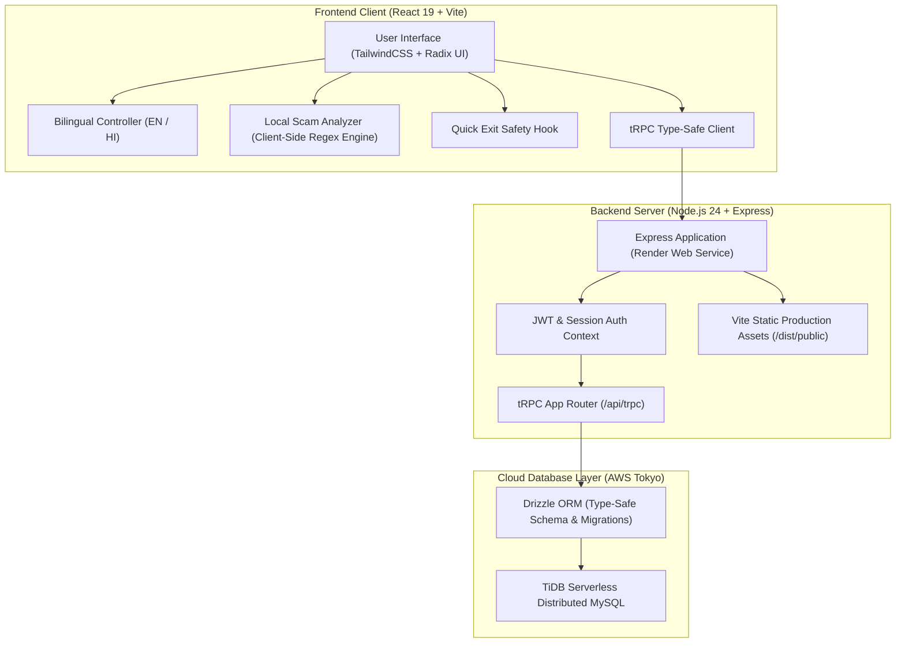
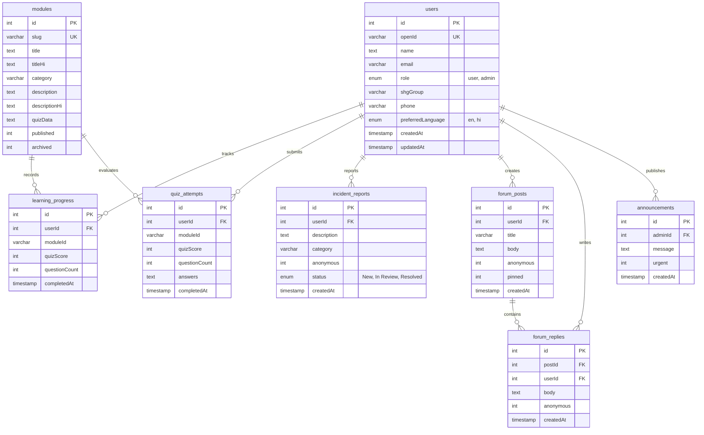

# DigiSakhi (डिजी सखी) — Digital Safety Companion for Women SHGs

[](https://digisakhi-32j7.onrender.com)
[](https://github.com/sachin-saroj/digisakhi)
[](https://github.com/sachin-saroj/digisakhi)
[](https://tidbcloud.com)
[](LICENSE)

> **Live Application URL:** **[https://digisakhi-32j7.onrender.com](https://digisakhi-32j7.onrender.com)**  
> **Source Repository:** **[https://github.com/sachin-saroj/digisakhi](https://github.com/sachin-saroj/digisakhi)**

---

## 📌 Executive Summary

**DigiSakhi** is a mobile-first, bilingual (English & हिन्दी) cyber-safety and digital literacy web application designed specifically for members of **Women’s Self-Help Groups (SHGs)**. 

As digital financial systems like UPI, Aadhaar-enabled payment systems (AePS), and micro-banking reach rural and semi-urban communities, women are increasingly targeted by financial fraud, phishing scams, OTP fraud, and social engineering. DigiSakhi bridges this literacy gap with gentle, practical education, client-side privacy-first scam analysis, anonymous cyber-incident reporting, emergency hotlines, a peer support forum, and an administrative governance console for group coordinators.

---

## 🚀 Key Features

### 1. 🎓 Interactive Bilingual Cyber Learning
* **Modular Curriculum:** Micro-lessons covering UPI safety, password hygiene, recognizing fake lottery/KYC messages, social media privacy, and safe digital banking.
* **Dual Language Support:** Instant toggling between **English** and **हिन्दी** across all lessons, interface labels, and interactive tools.
* **Knowledge Check Quizzes:** Interactive quizzes evaluate understanding and persist completion metrics and scores directly into cloud database tables.

### 2. 🛡️ Privacy-First Client-Side Scam Checker
* Analyzes suspicious SMS, WhatsApp, and email messages for malicious patterns.
* Evaluates urgency triggers, fake lottery promises, OTP/PIN collection attempts, phishing domain structures, and fraudulent APK downloads.
* **Zero Cloud Leakage:** Analysis runs 100% locally inside the browser. The user's pasted personal messages are never transmitted to external servers.

### 3. 🚨 Anonymous Incident Reporting
* Members who experience harassment, financial loss, or suspicious attempts can submit an incident report.
* Supports **Anonymous Submission** to protect dignity and encourage reporting without social stigma.
* Coordinators and admins can triage reports through states: `New` ➔ `In Review` ➔ `Resolved`.

### 4. ⚡ Emergency Assistance & Quick Exit
* **Direct Emergency Hotlines:** 1-tap dialing for the National Cyber Crime Helpline (**1930**), Women Helpline (**1091**), and Emergency Services (**112**).
* **Quick Exit Mechanism:** A persistent emergency exit button that instantly redirects the browser to a neutral weather website, protecting users in sensitive situations.

### 5. 👥 Community Peer Forum
* Peer-to-peer discussion board for SHG members to share safety experiences, ask questions, and warn neighbors about emerging local scams.
* Optional anonymous authoring and coordinator message pinning.

### 6. 📊 Coordinator & Admin Governance Portal
* Role-aware dashboard for SHG leaders and programme managers.
* Broadcast urgent alerts to all active members.
* Real-time visibility into module completion rates and reported incidents.

---

## 🏗️ System Architecture & Workflow



### End-to-End Workflow Breakdown

1. **Member Onboarding & Authentication:**
   * User registers or signs in with their role (`user` or `admin`) and SHG group affiliation.
   * Credentials and tokens are verified through the tRPC backend; authenticated sessions are established via secure cookies/JWT.
2. **Learning & Knowledge Evaluation:**
   * Member opens a module. Content is fetched from the `modules` table.
   * Upon completing the module quiz, answers are evaluated and pushed via `digisakhi.saveQuizAttempt` to both `quiz_attempts` (full audit log) and `learning_progress` (unique per-user module summary).
3. **Incident Reporting Pipeline:**
   * A member submits details of a suspicious transaction or message.
   * The mutation `digisakhi.submitIncident` writes to the `incident_reports` table with status `New`.
   * Admins view and triage incidents on the coordinator dashboard, updating status to `In Review` or `Resolved`.
4. **Community Collaboration:**
   * Members publish questions or warnings to `forum_posts`.
   * Other members respond via `forum_replies`. Anonymous flags sanitize identity from payload queries before returning to the frontend.

---

## 🗄️ Database Architecture (TiDB Cloud MySQL)

The database runs on **TiDB Cloud Serverless** (MySQL 8.0 wire-compatible, hosted in AWS Tokyo region) and is managed via **Drizzle ORM**. It features 8 relational tables:



### Detailed Schema Reference

| Table Name | Purpose | Key Columns & Constraints |
| :--- | :--- | :--- |
| `users` | User accounts, credentials, and role governance | `id` (PK, Auto-inc), `openId` (Unique), `role` (`user`/`admin`), `shgGroup`, `preferredLanguage` (`en`/`hi`). |
| `modules` | Educational curriculum modules | `id` (PK), `slug` (Unique), `title`, `titleHi`, `description`, `quizData` (JSON payload of questions), `published`. |
| `learning_progress` | Consolidated user completion states | `id` (PK), `userId`, `moduleId`, `quizScore`, `questionCount`. Composite unique constraint on `(userId, moduleId)`. |
| `quiz_attempts` | Historical audit log of every quiz taken | `id` (PK), `userId`, `moduleId`, `quizScore`, `questionCount`, `answers` (JSON serialised choices), `completedAt`. |
| `incident_reports` | Fraud and harassment reporting logs | `id` (PK), `userId` (nullable for anonymous), `category`, `description`, `anonymous` (1/0), `status` (`New`/`In Review`/`Resolved`). |
| `forum_posts` | Peer discussions and safety questions | `id` (PK), `userId`, `title`, `body`, `anonymous` (1/0), `pinned` (1/0), `createdAt`. |
| `forum_replies` | Responses to community posts | `id` (PK), `postId` (FK to forum_posts), `userId`, `body`, `anonymous`, `createdAt`. |
| `announcements` | Urgent coordinator alerts & notices | `id` (PK), `adminId`, `message`, `urgent` (1/0), `createdAt`. |

---

## 💻 Tech Stack

### Frontend
* **Core:** React 19, TypeScript
* **Build System:** Vite 7
* **Styling:** TailwindCSS, Class Variance Authority, Radix UI Primitives
* **Icons & Animation:** Lucide React, Framer Motion
* **Routing & Client State:** Wouter, TanStack React Query v5

### Backend & API
* **Runtime:** Node.js 24 (LTS)
* **Framework:** Express 4.21
* **API Layer:** tRPC v11 (End-to-end type-safe Remote Procedure Calls)
* **Authentication:** JWT with HTTP-only cookie support & role validation middleware

### Database & Persistence
* **Database:** TiDB Serverless (Cloud MySQL-compatible, distributed architecture)
* **ORM:** Drizzle ORM 0.44 with Drizzle Kit 0.31
* **Connection Pooling:** TLS/SSL-enabled MySQL2 pool with certificate verification

### Infrastructure & Deployment
* **Hosting:** Render.com (Native Node.js Web Service)
* **Live Domain:** `https://digisakhi-32j7.onrender.com`
* **Version Control:** Git, GitHub (`sachin-saroj/digisakhi`)

---

## 🛠️ Local Development Setup

### Prerequisites
* **Node.js:** `v20.0.0` or higher (recommended: `v24.x`)
* **Package Manager:** `pnpm` (`v10.x`)

### Installation Steps

1. **Clone the repository:**
   ```bash
   git clone https://github.com/sachin-saroj/digisakhi.git
   cd digisakhi
   ```

2. **Install dependencies:**
   ```bash
   pnpm install
   ```

3. **Configure Environment Variables:**
   Create a `.env` file in the project root:
   ```env
   # Database connection (TiDB Cloud / MySQL)
   DATABASE_URL="mysql://<user>:<password>@<host>:4000/<database>"

   # Authentication Secrets
   JWT_SECRET="your_secure_random_jwt_secret"
   NODE_ENV="development"
   PORT=3000
   ```

4. **Synchronize Database Schema:**
   Apply Drizzle schema migrations to your database:
   ```bash
   pnpm db:push
   ```

5. **Start Local Development Server:**
   ```bash
   pnpm dev
   ```
   Open `http://localhost:3000` in your browser.

6. **Launch Drizzle Studio (Database GUI):**
   ```bash
   pnpm drizzle-kit studio
   ```
   Open `https://local.drizzle.studio` to inspect and manage database records in real time.

---

## 🧪 Testing & Verification

The project includes unit and integration tests powered by **Vitest**:

```bash
# Run all test suites
pnpm test

# Type-check TypeScript codebase
pnpm check

# Build production bundle
pnpm build
```

**Verification Results:**
* **Test Suites:** 5 passed (21 tests total)
* **Coverage Areas:** User authentication, authorization contexts, quiz calculation engine, safety utilities, and live database integration queries.
* **Production Build:** Passes in ~6 seconds with Vite frontend bundling and esbuild server compilation.

---

## 🎓 College Viva & Evaluation FAQ

When presenting DigiSakhi to evaluators or viva examiners, reference these core architectural points:

**Q1: Where is the database hosted, and how is it connected?**
> *"The database is hosted on **TiDB Cloud Serverless** in the AWS Tokyo region (`gateway01.ap-northeast-1.prod.aws.tidbcloud.com`). It communicates using standard MySQL protocol over a TLS/SSL encrypted connection pool managed by **Drizzle ORM**."*

**Q2: How does the Scam Checker protect user privacy?**
> *"The scam detection engine operates entirely **client-side** in JavaScript using heuristic pattern matching and regular expressions. Users' pasted personal messages, transaction alerts, or phone numbers never leave the browser and are never stored on any server."*

**Q3: How is data flow organized between the frontend and database?**
> *"Data communication is completely type-safe via **tRPC**. When a user completes a quiz, the frontend calls the procedure `trpc.digisakhi.saveQuizAttempt.useMutation()`. The Express backend validates the payload, applies business logic, and executes parameterized queries through Drizzle ORM to update `learning_progress` and `quiz_attempts`."*

**Q4: How does role-based access control work?**
> *"Users are assigned either the `user` or `admin` role in the `users` table. Administrative tRPC procedures (`createAnnouncement`, `updateIncidentStatus`) are guarded by middleware that validates the user's role from their decoded session token before allowing execution."*

---

## 📄 License

This project is licensed under the [MIT License](LICENSE).
